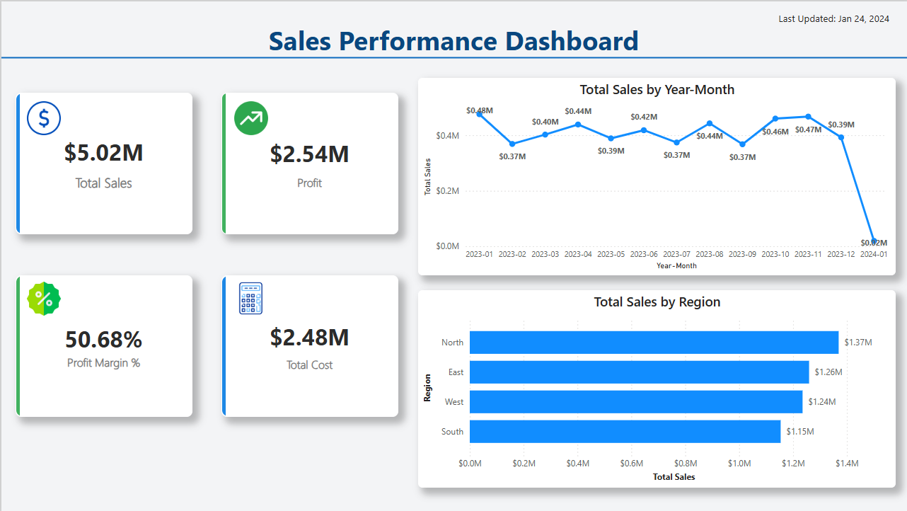
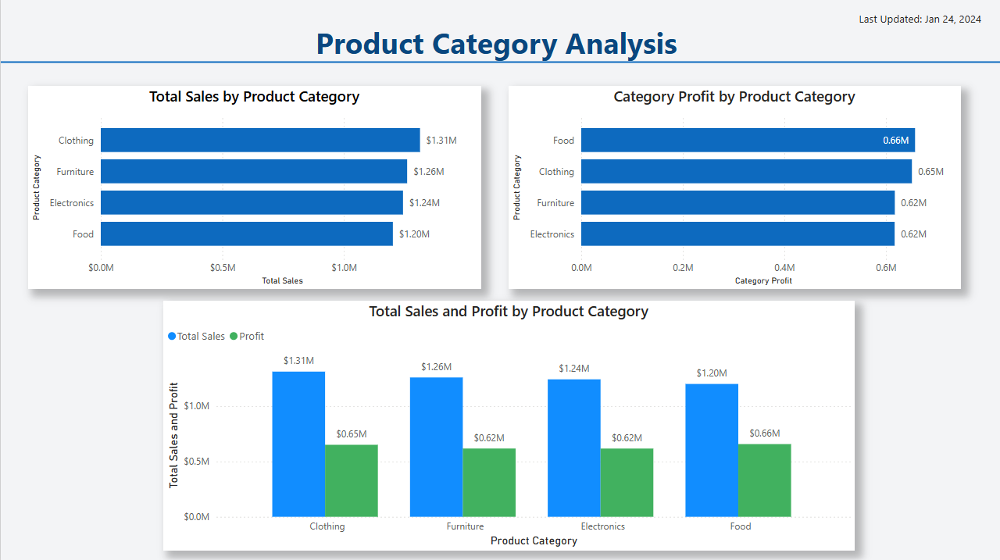
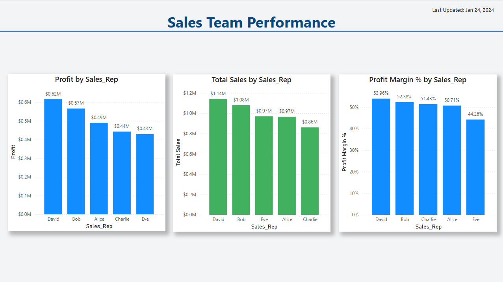

# Sales-Analysis-PowerBI

## Project Overview

This Power BI project analyzes sales performance, profitability, product categories, and sales team performance using an interactive dashboard.

The project demonstrates data cleaning, data modeling, DAX calculations, and dashboard design techniques used in business intelligence reporting.

---

## Tools Used

- Power BI
- Power Query
- DAX
- Excel
- Data Modeling

---

## Dashboard Pages

### Executive Overview

### Product Analysis

### Sales Team Performance

---

## Key Metrics

- Total Sales
- Total Profit
- Profit Margin
- Total Cost
- Sales by Region
- Sales by Product Category
- Sales Team Performance

---

## Data Model

Star Schema Design

### Fact Table
- Sales Data

### Dimension Tables
- Date
- Product
- Sales Representative
- Customer Type

---

## DAX Measures

Examples of measures created in this project:

- Total Sales
- Total Profit
- Profit Margin %
- Total Cost
- Product Profit
- Product Sales

---

## Key Insights

- Clothing generated the highest total sales.
- Food achieved the highest profitability.
- Regional sales performance was relatively balanced.
- David achieved the highest sales performance among sales representatives.

---

## Skills Demonstrated

- Data Cleaning
- Data Transformation
- Data Modeling
- DAX
- Dashboard Design
- Business Intelligence Reporting
